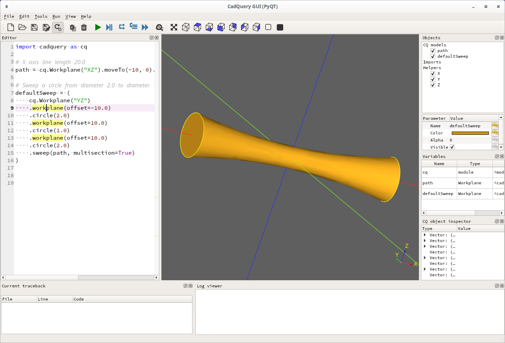

# CadQuery sweep problem

John Billingsley reported a [problem with sweep]( https://groups.google.com/g/cadquery/c/UrPx8CiSdY0/m/rYtuHCR6AgAJ).

This is my attempt to see what's wrong.

After a few steps I got to "how" to do the actual sweep
and searched the cadquery sources and found
Ex024_Sweep_With_Multiple_Sections.py. Looks to be a good
starting point:

Extract the frist example from Ex024 to x1.py:
```
import cadquery as cq

# X axis line length 20.0
path = cq.Workplane("XZ").moveTo(-10, 0).lineTo(10, 0)

# Sweep a circle from diameter 2.0 to diameter 1.0 to diameter 2.0 along X axis length 10.0 + 10.0
defaultSweep = (
    cq.Workplane("YZ")
    .workplane(offset=-10.0)
    .circle(2.0)
    .workplane(offset=10.0)
    .circle(1.0)
    .workplane(offset=10.0)
    .circle(2.0)
    .sweep(path, multisection=True)
)
```


