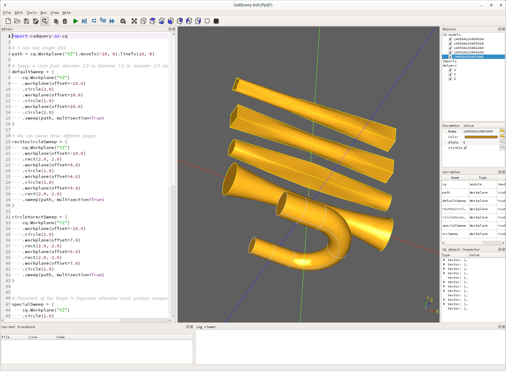

# CadQuery sweep problem

John Billingsley reported a [problem with sweep]( https://groups.google.com/g/cadquery/c/UrPx8CiSdY0/m/rYtuHCR6AgAJ).

This is my attempt to see what's wrong.

After a few steps I got to "how" to do the actual sweep
and searched the cadquery sources and found
Ex024_Sweep_With_Multiple_Sections.py. Looks to be a good
starting point:

```
(cq-dev) wink@3900x:~/prgs/CadQuery/projects/billingsley (master)
$ cat -n Ex024_Sweep_With_Multiple_Sections.py 
     1	import cadquery as cq
     2	
     3	# X axis line length 20.0
     4	path = cq.Workplane("XZ").moveTo(-10, 0).lineTo(10, 0)
     5	
     6	# Sweep a circle from diameter 2.0 to diameter 1.0 to diameter 2.0 along X axis length 10.0 + 10.0
     7	defaultSweep = (
     8	    cq.Workplane("YZ")
     9	    .workplane(offset=-10.0)
    10	    .circle(2.0)
    11	    .workplane(offset=10.0)
    12	    .circle(1.0)
    13	    .workplane(offset=10.0)
    14	    .circle(2.0)
    15	    .sweep(path, multisection=True)
    16	)
    17	
    18	# We can sweep thrue different shapes
    19	recttocircleSweep = (
    20	    cq.Workplane("YZ")
    21	    .workplane(offset=-10.0)
    22	    .rect(2.0, 2.0)
    23	    .workplane(offset=8.0)
    24	    .circle(1.0)
    25	    .workplane(offset=4.0)
    26	    .circle(1.0)
    27	    .workplane(offset=8.0)
    28	    .rect(2.0, 2.0)
    29	    .sweep(path, multisection=True)
    30	)
    31	
    32	circletorectSweep = (
    33	    cq.Workplane("YZ")
    34	    .workplane(offset=-10.0)
    35	    .circle(1.0)
    36	    .workplane(offset=7.0)
    37	    .rect(2.0, 2.0)
    38	    .workplane(offset=6.0)
    39	    .rect(2.0, 2.0)
    40	    .workplane(offset=7.0)
    41	    .circle(1.0)
    42	    .sweep(path, multisection=True)
    43	)
    44	
    45	
    46	# Placement of the Shape is important otherwise could produce unexpected shape
    47	specialSweep = (
    48	    cq.Workplane("YZ")
    49	    .circle(1.0)
    50	    .workplane(offset=10.0)
    51	    .rect(2.0, 2.0)
    52	    .sweep(path, multisection=True)
    53	)
    54	
    55	# Switch to an arc for the path : line l=5.0 then half circle r=4.0 then line l=5.0
    56	path = (
    57	    cq.Workplane("XZ")
    58	    .moveTo(-5, 4)
    59	    .lineTo(0, 4)
    60	    .threePointArc((4, 0), (0, -4))
    61	    .lineTo(-5, -4)
    62	)
    63	
    64	# Placement of different shapes should follow the path
    65	# cylinder r=1.5 along first line
    66	# then sweep allong arc from r=1.5 to r=1.0
    67	# then cylinder r=1.0 along last line
    68	arcSweep = (
    69	    cq.Workplane("YZ")
    70	    .workplane(offset=-5)
    71	    .moveTo(0, 4)
    72	    .circle(1.5)
    73	    .workplane(offset=5)
    74	    .circle(1.5)
    75	    .moveTo(0, -8)
    76	    .circle(1.0)
    77	    .workplane(offset=-5)
    78	    .circle(1.0)
    79	    .sweep(path, multisection=True)
    80	)
    81	
    82	
    83	# Translate the resulting solids so that they do not overlap and display them left to right
    84	show_object(defaultSweep)
    85	show_object(circletorectSweep.translate((0, 5, 0)))
    86	show_object(recttocircleSweep.translate((0, 10, 0)))
    87	show_object(specialSweep.translate((0, 15, 0)))
    88	show_object(arcSweep.translate((0, -5, 0)))
```

Which produces this output using cq-editor:


