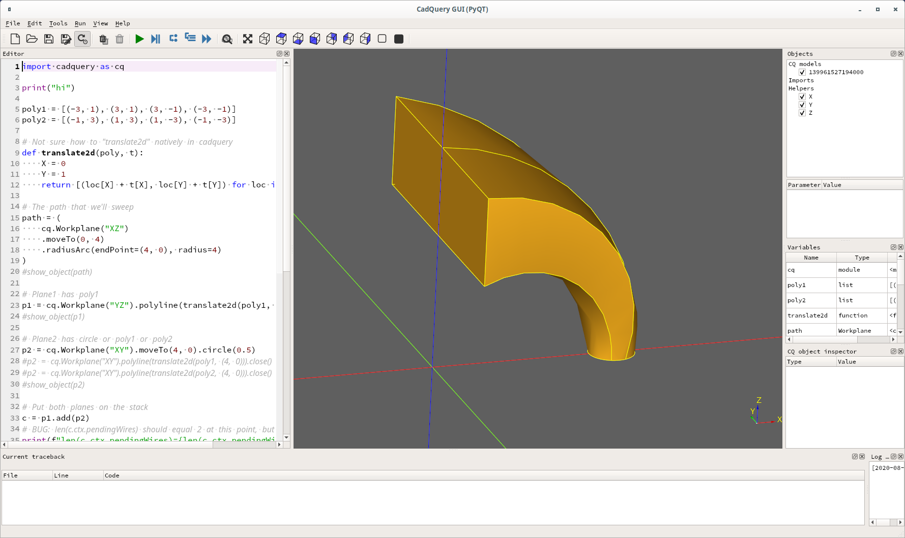
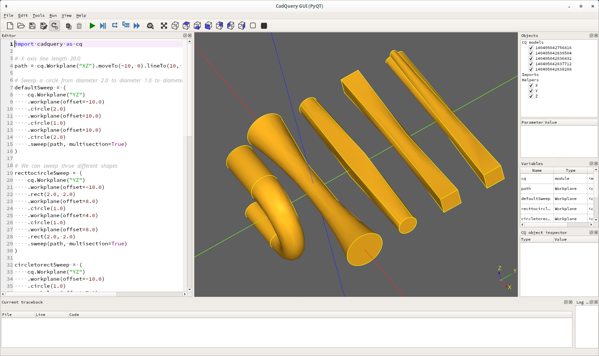

# CadQuery sweep problem

John Billingsley reported a [problem with sweep]( https://groups.google.com/g/cadquery/c/UrPx8CiSdY0/m/rYtuHCR6AgAJ).

This is my attempt to see what's wrong.

This is loosely based on examples in
[Ex024_Sweep_With_Multiple_Sectionsw.py]().
And I believe should work is the code though line 39 below,
but is doesn't. It failure is because `p1.add(p2)` at line 3
does not call _addPendingWires, and I think it should. In
anycase the hack I came up with is to clear pendingWires and
then call [each()](https://github.com/CadQuery/cadquery/blob/cc1f8f3183a16a1d222959c5860280e7bd3259bb/cadquery/cq.py#L2077)
with a nop look() function, lines 46 0 51. This works because each()
to calls [_addPendingWires](https://github.com/CadQuery/cadquery/blob/cc1f8f3183a16a1d222959c5860280e7bd3259bb/cadquery/cq.py#L2123)
for non-construction wires:
```
$ cat -n solution.py 
     1	import cadquery as cq
     2	
     3	print("hi")
     4	
     5	poly1 = [(-3, 1), (3, 1), (3, -1), (-3, -1)]
     6	poly2 = [(-1, 3), (1, 3), (1, -3), (-1, -3)]
     7	
     8	# Not sure how to "translate2d" natively in cadquery
     9	def translate2d(poly, t):
    10	    X = 0
    11	    Y = 1
    12	    return [(loc[X] + t[X], loc[Y] + t[Y]) for loc in poly]
    13	
    14	# The path that we'll sweep
    15	path = (
    16	    cq.Workplane("XZ")
    17	    .moveTo(0, 4)
    18	    .radiusArc(endPoint=(4, 0), radius=4)
    19	)
    20	#show_object(path)
    21	
    22	# Plane1 has poly1
    23	p1 = cq.Workplane("YZ").polyline(translate2d(poly1, (0, 4))).close()
    24	#show_object(p1)
    25	
    26	# Plane2 has circle or poly1 or poly2
    27	p2 = cq.Workplane("XY").moveTo(4, 0).circle(0.5)
    28	#p2 = cq.Workplane("XY").polyline(translate2d(poly1, (4, 0))).close()
    29	#p2 = cq.Workplane("XY").polyline(translate2d(poly2, (4, 0))).close()
    30	#show_object(p2)
    31	
    32	# Put both planes on the stack
    33	c = p1.add(p2)
    34	# BUG: len(c.ctx.pendingWires) should equal 2 at this point, but it equals 1
    35	print(f"len(c.ctx.pendingWires)={len(c.ctx.pendingWires)}")
    36	#show_object(c)
    37	
    38	# This does NOT work, but I believe it should
    39	#result = c.sweep(path, multisection=True)
    40	
    41	# Looking at pendingWires and _addPendingWire() I discovered that
    42	# each() adds appends wires to pendingWires. I used that fact to
    43	# make this work.
    44	
    45	# Clear pendingWires, otherwise the result is 3, although not a fatal error.
    46	c.ctx.pendingWires = []
    47	
    48	def look(shape):
    49	    print(f"type(shape)={type(shape)}")
    50	    return shape
    51	r = c.each(look)
    52	print(f"len(r.ctx.pendingWires)={len(r.ctx.pendingWires)}")
    53	#show_object(r)
    54	
    55	# sweep out the multisection's that are on the stack 
    56	result = r.sweep(path, multisection=True)
    57	
    58	show_object(result)
```



Here is the Ex024_Sweep_With_Multipel_Sections.py:
```
(cq-dev) wink@3900x:~/prgs/CadQuery/projects/billingsley (master)
$ cat -n Ex024_Sweep_With_Multiple_Sections.py 
     1	import cadquery as cq
     2	
     3	# X axis line length 20.0
     4	path = cq.Workplane("XZ").moveTo(-10, 0).lineTo(10, 0)
     5	
     6	# Sweep a circle from diameter 2.0 to diameter 1.0 to diameter 2.0 along X axis length 10.0 + 10.0
     7	defaultSweep = (
     8	    cq.Workplane("YZ")
     9	    .workplane(offset=-10.0)
    10	    .circle(2.0)
    11	    .workplane(offset=10.0)
    12	    .circle(1.0)
    13	    .workplane(offset=10.0)
    14	    .circle(2.0)
    15	    .sweep(path, multisection=True)
    16	)
    17	
    18	# We can sweep thrue different shapes
    19	recttocircleSweep = (
    20	    cq.Workplane("YZ")
    21	    .workplane(offset=-10.0)
    22	    .rect(2.0, 2.0)
    23	    .workplane(offset=8.0)
    24	    .circle(1.0)
    25	    .workplane(offset=4.0)
    26	    .circle(1.0)
    27	    .workplane(offset=8.0)
    28	    .rect(2.0, 2.0)
    29	    .sweep(path, multisection=True)
    30	)
    31	
    32	circletorectSweep = (
    33	    cq.Workplane("YZ")
    34	    .workplane(offset=-10.0)
    35	    .circle(1.0)
    36	    .workplane(offset=7.0)
    37	    .rect(2.0, 2.0)
    38	    .workplane(offset=6.0)
    39	    .rect(2.0, 2.0)
    40	    .workplane(offset=7.0)
    41	    .circle(1.0)
    42	    .sweep(path, multisection=True)
    43	)
    44	
    45	
    46	# Placement of the Shape is important otherwise could produce unexpected shape
    47	specialSweep = (
    48	    cq.Workplane("YZ")
    49	    .circle(1.0)
    50	    .workplane(offset=10.0)
    51	    .rect(2.0, 2.0)
    52	    .sweep(path, multisection=True)
    53	)
    54	
    55	# Switch to an arc for the path : line l=5.0 then half circle r=4.0 then line l=5.0
    56	path = (
    57	    cq.Workplane("XZ")
    58	    .moveTo(-5, 4)
    59	    .lineTo(0, 4)
    60	    .threePointArc((4, 0), (0, -4))
    61	    .lineTo(-5, -4)
    62	)
    63	
    64	# Placement of different shapes should follow the path
    65	# cylinder r=1.5 along first line
    66	# then sweep allong arc from r=1.5 to r=1.0
    67	# then cylinder r=1.0 along last line
    68	arcSweep = (
    69	    cq.Workplane("YZ")
    70	    .workplane(offset=-5)
    71	    .moveTo(0, 4)
    72	    .circle(1.5)
    73	    .workplane(offset=5)
    74	    .circle(1.5)
    75	    .moveTo(0, -8)
    76	    .circle(1.0)
    77	    .workplane(offset=-5)
    78	    .circle(1.0)
    79	    .sweep(path, multisection=True)
    80	)
    81	
    82	
    83	# Translate the resulting solids so that they do not overlap and display them left to right
    84	show_object(defaultSweep)
    85	show_object(circletorectSweep.translate((0, 5, 0)))
    86	show_object(recttocircleSweep.translate((0, 10, 0)))
    87	show_object(specialSweep.translate((0, 15, 0)))
    88	show_object(arcSweep.translate((0, -5, 0)))```
```

And here is the cq-editor output:


